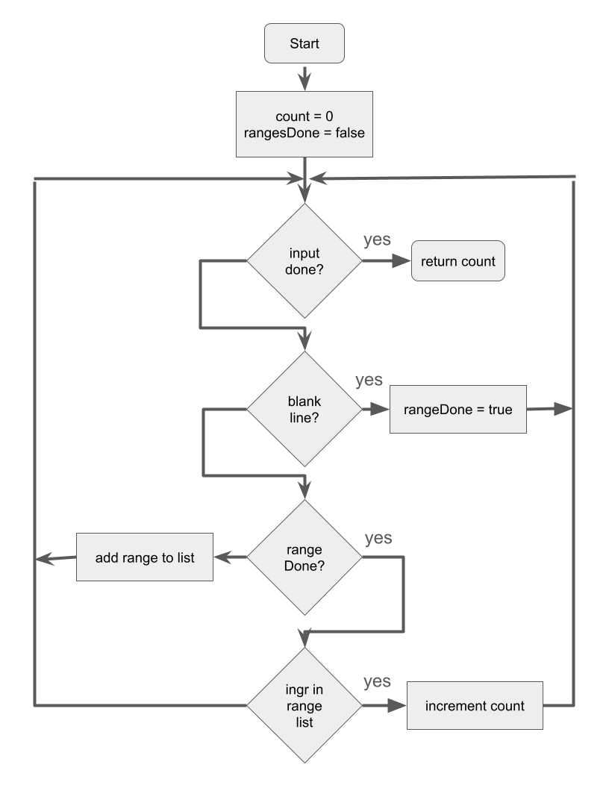
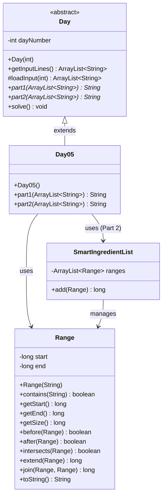

# Day 5: Cafeteria

> **Note:** This writeup was generated with assistance from GitHub Copilot (Claude Sonnet 4.5) to document the solution and pedagogical approach.

## Problem Summary

Day 5 takes place in the cafeteria kitchen, where the Elves are struggling with their new inventory management system. They need help determining which ingredient IDs are fresh based on ranges of fresh IDs.

**Input Format:**
```
3-5
10-14
16-20
12-18

1
5
8
11
17
32
```
- First section: Ranges of fresh ingredient IDs (inclusive, can overlap)
- Second section: List of available ingredients (after blank line)

## The YAGNI Principle: You Aren't Gonna Need It

When I first read Part 1 and saw the line "The ranges can also overlap," my immediate instinct was to implement range merging logic. As an experienced programmer, I recognized this as a classic interval merging problem.

**But then I stopped and remembered YAGNI.**

YAGNI (You Aren't Gonna Need It) is a software development principle that says you should not add functionality until it's actually needed. This is especially important in Advent of Code, which is famous for Part 2 plot twists.

### Why YAGNI Matters in AoC

Consider what could have happened:
1. I spend 20 minutes implementing sophisticated range merging for Part 1
2. Part 2 asks for something completely different (run-length encoding, intersection counts, etc.)
3. All that merging code becomes wasted effort

Instead, I took the simpler approach:
- **Part 1:** Just check each ingredient against all ranges using nested loops
- **Part 2:** *Wait and see* what's actually required

This is a valuable lesson for students: **Solve the problem you have, not the problem you think you might have later.**

---

## Part 1: Simple Range Checking

### Problem Statement
Given ranges of fresh ingredient IDs and a list of available ingredients, count how many available ingredients are fresh. An ingredient is fresh if it falls within any range. Ranges are inclusive and can overlap (e.g., `3-5` means IDs 3, 4, and 5 are fresh).

**Example Answer:** 3 fresh ingredients (5, 11, 17)

### Solving with Code.org's Problem Solving Process

Code.org teaches a 4-step problem-solving framework: **Understand → Plan → Try → Reflect**. Let's apply it to Part 1.

#### 1. Understand: Visualize the Data

Before writing code, visualize the sample data to understand the problem:

```
        0         1         2         3
        0123456789012345678901234567890123
        ─────────────────────────────────
 3-5       ███
10-14             █████
16-20                   █████
12-18               ███████
        ──────────────────────────────────
Union      ███    ███████████
         x   o  x  o     o              x

Ingredients:
  1     x (not in any range)
  5     o (in range 3-5)
  8     x (not in any range)
 11     o (in ranges 10-14 and 12-18)
 17     o (in ranges 16-20 and 12-18)
 32     x (not in any range)
```

This visual reveals:
- Ranges can overlap (10-14 and 12-18 both cover 12-14)
- We only need to check if each ingredient falls in *any* range
- The union is interesting but not needed for Part 1!

#### 2. Plan: Design the Algorithm



**Strategy:**
- **State tracking:** Use `rangesDone` flag to switch between two parsing phases
- **Two-phase parsing:** First phase reads ranges, second phase checks ingredients
- **Loop structure:** While more input lines exist, process based on current phase
- **Blank line detection:** Signals transition from ranges to ingredients phase
- **Early exit optimization:** When ingredient found in any range, count it and move to next

#### 3. Try: Implementation

Part 1 is straightforward - iterate through available ingredients and check if each falls within any range:

```java
for (String line : input) {
    if (line.equals("")) {
        rangesDone = true;
        continue;
    }
    
    if (!rangesDone) {
        ranges.add(new Range(line));
    } else {
        for (Range range : ranges) {
            if (range.contains(line)) {
                numberFresh += 1;
                break;  // Don't double-count
            }
        }
    }
}
```

**Key concepts:**
- State machine pattern (`rangesDone` flag)
- Enhanced for loops
- Early exit with `break`
- Encapsulation: `Range` constructor parses its own format (`"3-5"`)

#### 4. Reflect: Debug and Validate

**Debugging with print statements:**
```java
// Add debug output to verify logic (commented out for production)
if (range.contains(line)) {
    // System.out.println(line.trim() + " found in [" + range.getStart() + ", " + range.getEnd() + ")");
    numberFresh += 1;
    break;
}
```

**Validation steps:**
1. **Compare to problem statement:** Does output match example (3 fresh ingredients)?
2. **Run on real data:** Submit answer... success! ✓
3. **Check data types:** Wait - real answer is very large. Need to switch from `int` to `long` for Part 2!

This reflection step caught a potential overflow issue before it became a problem in Part 2.

### Complexity Analysis
- **Time:** $O(n \times m)$ where $n$ is available ingredients, $m$ is ranges
- **Space:** $O(m)$ for storing ranges

### Why Not Merge Ranges?

Notice we're checking each ingredient against *all* ranges individually. The ranges can overlap, but we don't care - we just need to know if an ingredient is in *any* range.

This is the YAGNI principle in action: range merging would be more work for no benefit in Part 1.

---

## Part 2: Interval Merging Algorithm

### Problem Statement
Ignore the available ingredients list. Instead, calculate the total count of all unique ingredient IDs that are considered fresh across all ranges. This requires merging overlapping ranges to avoid counting IDs multiple times.

**Example Answer:** 14 total fresh IDs (3,4,5,10,11,12,13,14,15,16,17,18,19,20)

### The Plot Twist

And here it is - Part 2 *does* require range merging! But that's okay - I hadn't wasted time over-engineering Part 1, and I could now focus entirely on the actual requirement. The key insight is that premature optimization is a form of technical debt.

### Algorithm Design

The `SmartIngredientList` class maintains a sorted list of non-overlapping ranges. When adding a new range, there are three cases:

1. **No intersection:** Range fits between two existing ranges
2. **Intersects both:** Bridges and merges three ranges into one
3. **Intersects one:** Extends a single existing range (either lower or upper)

The algorithm processes ranges as they're added, maintaining the invariant that ranges in the list never overlap. This is more efficient than sorting and merging at the end.

**Time Complexity:** $O(n \times m)$ where $n$ is number of ranges and $m$ is average list size (which stays small due to merging)

**Space Complexity:** $O(m)$ for the merged range list

### The Debug Story

I had a bug in Part 2 where certain range combinations weren't merging correctly. The sample data only covered some of the three cases, so I needed better test coverage.

**My debugging technique:** I manually modified the sample data to force all edge cases:
- Removed line 2 (`10-14`) to test case 1 (no intersection)
- Removed line 3 (`16-20`) alternately to test case 2 (triple intersection/bridge)
- This isolated which case was failing

The bug was in the `join()` method - I had the wrong calculation for gap size when merging three ranges. By creating targeted test cases, I quickly identified and fixed the issue.

**Lesson:** When your test data doesn't cover all code paths, *modify* the test data rather than just staring at the code.

## Advanced Implementation Note

**Important:** The current implementation is more sophisticated than what's typically expected at the AP CSA level. While it demonstrates professional software engineering practices, a high school solution would more likely:

1. Sort all ranges by start position
2. Iterate through sorted ranges linearly
3. Merge adjacent overlapping ranges into a new list

This simpler approach is more explicit, easier to debug, and better matches beginner programming skills. The in-place modification and complex case analysis in the current solution reflect experienced programmer patterns rather than typical student work.

---

## Class Structure

The solution uses an inheritance hierarchy with three main classes:



**Key relationships:**
- `Day05` **extends** abstract class `Day`, implementing the template method pattern
- `Day` provides common functionality (file loading, solve framework) for all daily solutions
- `Day05` uses `Range` objects in Part 1 for simple containment checking
- `Day05` uses `SmartIngredientList` in Part 2 for merging ranges
- `SmartIngredientList` maintains a collection of non-overlapping `Range` objects

---

## AP CSA Subset Compliance Notes

This solution adheres to the AP CSA Java subset with one notable exception:

**`long` and `Long.parseLong()`:** The problem requires handling ingredient IDs up to $6.8 \times 10^{15}$, which exceeds `int` range ($2.1 \times 10^9$). While `long` isn't explicitly in the AP CSA subset, it's a commonly accepted exception for problems requiring larger numeric ranges, similar to how AoC often requires handling large numbers.

Other subset considerations:
- Used `equals("")` instead of `isBlank()` (not in subset)
- Used `trim()` instead of `strip()` (not in subset)
- Used `Math.min()`/`Math.max()` instead of `Long.min()`/`Long.max()` (Math class is in subset)
- Used `IllegalArgumentException` instead of custom exceptions

---

## Teaching Notes

### YAGNI for Students

This problem is an excellent opportunity to teach YAGNI:

1. **Ask students:** "What would you implement after reading Part 1?"
2. **Discussion:** Why might range merging seem necessary? (The "ranges can overlap" hint)
3. **Reality check:** Is it actually needed for Part 1? (No - we just check each ingredient)
4. **Lesson:** Implement the simplest solution that works, then refactor when requirements change

### Interval Merging as an Extension

The interval merging algorithm makes an excellent extension activity:
- Discuss the three cases for range intersection
- Compare in-place vs. sort-and-merge approaches
- Analyze time/space trade-offs

For AP CSA classes, consider teaching the simpler sort-and-merge approach first, then showing the more efficient incremental merging as an advanced technique.

## AP CSA Learning Objectives

- **LO 1.3.C:** Arithmetic operations in range size calculations
- **LO 2.3.A:** Selection statements for case analysis
- **LO 2.7.B / 2.8.A:** Iteration with enhanced for loops and index-based loops
- **LO 4.1.A:** Object-oriented design with Range class
- **LO 4.8.A / 4.9.A:** ArrayList usage for dynamic collections
- **Design Patterns:** State machine (rangesDone flag), encapsulation, helper methods

## CSTA Standards for CS Teachers

This writeup aligns with the **CSTA Standards for CS Teachers (2020)**:

**Standard 4: Instructional Design** - Teachers design learning activities and develop assessments that support CS learning outcomes for all students.
- **4a. Learning Activities:** Demonstrates the Code.org problem-solving framework (Understand → Plan → Try → Reflect) as a structured approach to algorithm development
- **4b. Differentiation:** YAGNI principle and progressive complexity (Part 1 → Part 2) provide scaffolded learning paths for students at different levels
- **4c. Assessment:** The "Reflect" phase includes concrete validation steps and debugging strategies students can apply to verify their solutions

**Standard 5: Classroom Practice** - Teachers create an inclusive and culturally responsive learning environment that fosters student engagement in CS.
- **5a. Pedagogy:** Employs computational thinking practices including visualization (ASCII charts, flowcharts), algorithm design, and systematic testing/debugging
- **5b. Instructional Strategies:** Multiple representations (flowcharts, code, diagrams) and real-world context (cafeteria inventory management) support diverse learners

**Standard 1: CS Knowledge and Skills** - Teachers have computing and pedagogical content knowledge.
- **1a. Content Knowledge:** Demonstrates core CS concepts including algorithms, data structures (ArrayList), and OOP principles (inheritance via Day class, encapsulation in Range)

## Key Takeaways

1. **YAGNI is your friend** - especially in competitive programming with unknown Part 2 requirements
2. **Modify test data** to cover all code paths when debugging
3. **`long` is necessary** for large numeric ranges in AoC problems
4. **Case analysis** is crucial for interval merging algorithms
5. **Start simple, refactor when needed** - don't over-engineer solutions prematurely

The solution demonstrates professional software engineering practices while serving as a teaching moment about when to apply optimization and when to keep it simple.
